# Clase 1 — UML + POO

> **Unidad:** 1 (POO) · **Lenguaje de ejemplos:** TypeScript

---

## Clase 1 — UML + POO

**Programación II · Unidad 1**

> *"La esencia del modelado es la abstracción."* — Grady Booch

- **POO** → cómo pensamos y organizamos el código.
- **UML** → cómo lo dibujamos y comunicamos antes de escribirlo.

---

## ¿Qué es la Programación Orientada a Objetos?

Es un **paradigma**: una forma de resolver problemas estableciendo un **paralelismo con la realidad**.

En vez de pensar en "instrucciones sueltas", agrupamos datos y comportamiento en **entidades** llamadas **clases**.

**¿Para qué?** Para que el código sea:
- **Reutilizable** — escribo una vez, uso muchas.
- **Legible** — el código se parece al problema.
- **Mantenible** — un cambio queda contenido en un lugar.

---

## Clase vs. Objeto vs. Instancia vs. Tipo

Se usan como sinónimos, pero **no lo son**:

- **Clase** → la *plantilla* / especificación. Define qué características tiene un tipo de objeto, **sin valores**. Ej: la clase `Puerta` (con `alto`, `ancho`, `color`, `material`).
- **Tipo** → el tipo de dato que define esa clase.
- **Objeto / Instancia** → un espacio **real en memoria (RAM)** con valores concretos. Ej: *esta* puerta de madera, marrón, de 2m.

> Con **una clase** puedo crear **tantos objetos como necesite**. Cada objeto ocupa su propio lugar en memoria.

Se crea con la palabra reservada **`new`**:

```typescript
const miPuerta: Puerta = new Puerta();
```

---

## Anatomía de una clase

Una clase tiene:

- **Nombre** que la identifica.
- **Visibilidad** (nivel de exposición).
- **Atributos** → las variables (el *estado*).
- **Métodos / funciones** → el comportamiento.
- **Constructor** → método especial que se ejecuta al hacer `new`. Inicializa el objeto. **No declara tipo de retorno.**

> Atributos + métodos = **miembros** de la clase.

La palabra **`this`** es la *autorreferencia*: "el atributo de *esta* instancia", para distinguirlo de un parámetro con el mismo nombre.

---

## Ejemplo en TypeScript: clase `Person`

```typescript
class Person {
  private name: string;
  private lastname: string;

  constructor(name: string, lastname: string) {
    this.name = name;         // this.name (atributo) = name (parámetro)
    this.lastname = lastname;
  }

  getName(): string { return this.name; }        // getter
  setName(name: string): void { this.name = name; } // setter

  sayHi(): void {
    console.log(`Hola, soy ${this.name} ${this.lastname}`);
  }
}

const p = new Person("Ada", "Lovelace");
p.sayHi(); // Hola, soy Ada Lovelace
```

TypeScript también permite un atajo para inicializar atributos desde el constructor (*parameter properties*), que vamos a ver más adelante:

```typescript
class Person {
  constructor(private name: string, private lastname: string) {}
}
```

---

## Los 4 pilares de la POO

Cuatro ideas que sostienen todo el paradigma:

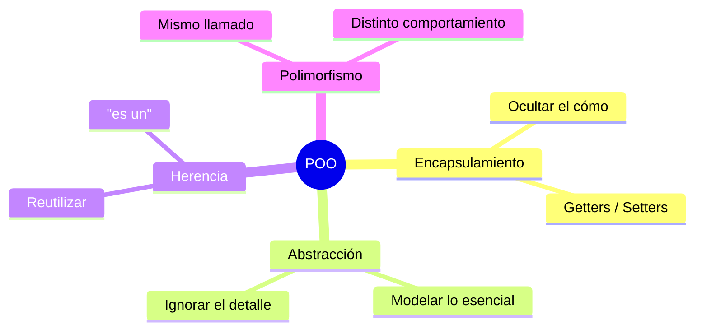

En las próximas slides, uno por uno.

---

## Pilar 1 — Encapsulamiento

**Ocultar el *cómo* y exponer solo el *qué*.**

La clase es una "caja hermética": sus miembros no se tocan desde afuera salvo que lo permitamos explícitamente.

**Convención:** todo atributo **privado**, y se accede mediante **getters** (leer) y **setters** (escribir).

- ¿Quiero solo lectura? → solo getter.
- ¿Solo escritura? → solo setter.
- Si fuera público, tendría **las dos** obligatoriamente.

**Beneficio:** puedo cambiar la implementación interna sin romper a quien me usa.

---

## Pilar 2 — Abstracción

**Quedarme con lo esencial del problema e ignorar el resto.**

Modelar una `Persona` para un banco ≠ modelarla para un hospital. Elijo **qué atributos y comportamientos importan** en *mi* contexto.

> La abstracción es *decidir qué dejar afuera*. Booch: "la esencia del modelado es la abstracción".

Herramientas que la POO nos da para abstraer: **clases abstractas** e **interfaces**.

---

## Pilar 3 — Herencia

**Crear una clase a partir de otra existente**, reutilizando sus miembros públicos y protegidos.

Relación **"es un"**: un `Employee` **es una** `Person`.

```typescript
class Person {
  constructor(protected name: string) {}
  getName(): string { return this.name; }
}

class Employee extends Person {
  constructor(name: string, public file: number) {
    super(name); // llama al constructor del padre (obligatorio)
  }
}
```

- Palabra clave: **`extends`**.
- TypeScript solo permite **herencia simple** (una sola clase base), igual que Java.
- **`super`** → referencia a la clase padre (constructor o métodos).

---

## Pilar 4 — Polimorfismo

**Mismo llamado, distinto comportamiento.**

Objetos distintos responden de forma diferente **al mismo método** (misma firma).

Surge de tres mecanismos:
- **Sobreescritura** (*overriding*) → dentro de una jerarquía de herencia.
- **Interfaces** → objetos de naturaleza distinta tratados igual.
- **Composición** → cambiar comportamiento en tiempo de ejecución.

```typescript
class Person   { sayHi() { console.log("Hola, soy una persona"); } }
class Employee extends Person { sayHi() { console.log("Hola, soy un empleado"); } }

const gente: Person[] = [new Person(), new Employee()];
gente.forEach(g => g.sayHi()); // cada uno responde distinto
```

Acá un `Employee` se trata como una `Person` (*upcasting* implícito): lo retomamos en clases futuras.

---

## UML: ¿para qué sirve?

**UML** (Unified Modeling Language) = un lenguaje **visual** estándar para modelar software.

Nos deja **diseñar y comunicar antes de programar**. Es como el plano del arquitecto.

Hay muchos tipos de diagramas; nosotros nos concentramos en el **diagrama de clases**, que muestra:
- Las **clases** (cajas).
- Sus **atributos y métodos**.
- Las **relaciones** entre ellas.

> Regla de oro: el UML debe ayudar a *entender*, no a decorar. Si un diagrama confunde, sobra.

---

## UML: la caja de una clase

Una clase se dibuja como una caja de **3 compartimentos**:

```
┌───────────────────────────┐
│        Person             │  ← nombre
├───────────────────────────┤
│ - name: string            │  ← atributos (estado)
│ - lastname: string        │
├───────────────────────────┤
│ + getName(): string       │  ← métodos (comportamiento)
│ + sayHi(): void           │
└───────────────────────────┘
```

Formato de un miembro: `visibilidad nombre: tipo`
Formato de un método: `visibilidad nombre(parámetros): tipoRetorno`

---

## UML: visibilidad

El símbolo antes del nombre indica **quién puede acceder**:

| Símbolo | Nivel | Quién accede |
|:---:|---|---|
| `+` | **público** (`public`) | todos |
| `-` | **privado** (`private`) | solo la propia clase |
| `#` | **protegido** (`protected`) | la clase y sus **subclases** |
| `~` | **paquete** (sin modificador) | clases del mismo paquete |

| Modificador | Clase | Paquete | Subclase | Mundo |
|---|:---:|:---:|:---:|:---:|
| `private` | ✅ | ❌ | ❌ | ❌ |
| *(sin modif.)* | ✅ | ✅ | ❌ | ❌ |
| `protected` | ✅ | ✅ | ✅ | ❌ |
| `public` | ✅ | ✅ | ✅ | ✅ |

> Ojo: en TypeScript, "sin modificador" es `public` por defecto (distinto de Java). El `~` de paquete casi no se usa en TS.

---

## UML: ejemplo de clase (Mermaid)

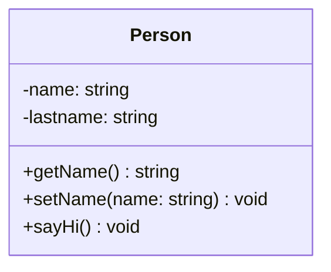

Esta caja se traduce **directo** a la clase `Person` que vimos en TypeScript. UML ↔ código son dos vistas de lo mismo.

---

## Relaciones entre clases (panorama)

Las clases no viven aisladas: se **relacionan**. Las 5 que tenemos que reconocer:

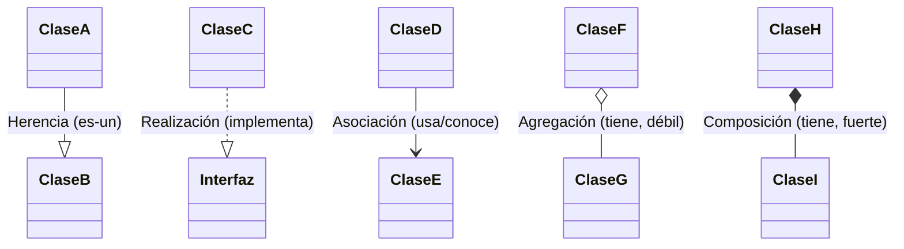

Cada flecha tiene un **significado distinto**. Vamos una por una.

---

## Herencia (generalización)

**"es un"** — una clase deriva de otra. Flecha con **triángulo vacío** apuntando al padre.

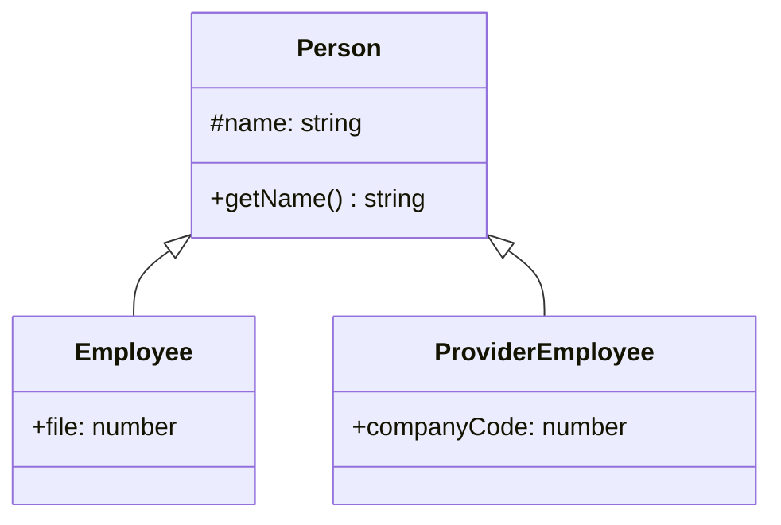

```typescript
class Employee extends Person { /* ... */ }
```

> Un `Employee` **es una** `Person` → hereda sus miembros públicos y protegidos.

**🔍 Cómo la reconozco**
- Pregunta clave: *"¿X **es un** Y?"* → si la respuesta suena natural, es herencia.
  - "Un perro **es un** animal" ✅ · "Un auto **es un** motor" ❌ (eso es composición).
- En el código aparece la palabra **`extends`**.
- La subclase puede **agregar** miembros nuevos y **sobreescribir** los heredados.

**Más ejemplos**
- `Animal <|-- Perro`, `Animal <|-- Gato`
- `Figura <|-- Circulo`, `Figura <|-- Rectangulo`
- `Exception <|-- EmployeeException` (una excepción propia **es una** excepción)

> ⚠️ Error típico: usar herencia solo para reutilizar código cuando **no** hay un "es un" real. Si no lo hay, preferí composición.

---

## Realización (interfaz)

**"se comporta como"** — una clase **implementa** una interfaz. Flecha con **triángulo vacío + línea punteada**.

Una **interfaz** define *solo las firmas* de los métodos, sin implementación.

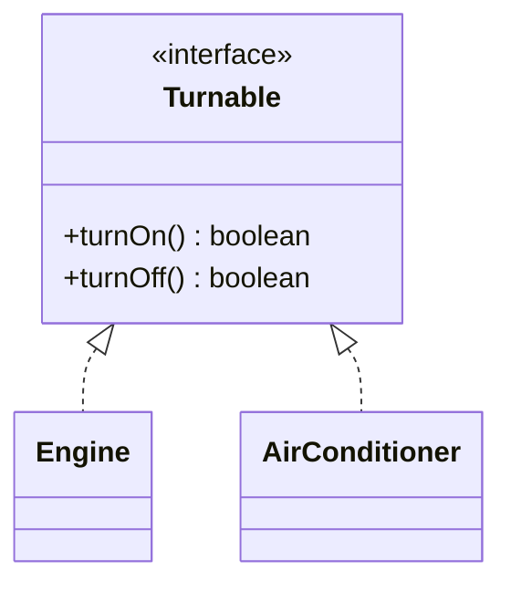

```typescript
interface Turnable { turnOn(): boolean; turnOff(): boolean; }
class Engine        implements Turnable { /* ... */ }
class AirConditioner implements Turnable { /* ... */ }
```

> El motor y el aire son cosas **distintas**, pero ambos son "encendibles/apagables".

**🔍 Cómo la reconozco**
- Pregunta clave: *"¿X **se comporta como / puede ser tratado como** Y?"* (sin ser lo mismo).
- Del lado de Y aparece el estereotipo **`<<interface>>`**.
- En el código, la clase usa **`implements`** (y puede implementar **varias** interfaces: `implements A, B`).
- La interfaz **no tiene código**, solo firmas → la clase está **obligada** a implementarlas todas.

**Más ejemplos**
- `Comparable <|.. Producto` (se puede comparar por precio)
- `Serializable <|.. Usuario` (se puede convertir a JSON)
- `Volador <|.. Pajaro`, `Volador <|.. Avion` (naturalezas distintas, mismo comportamiento)

> 💡 Diferencia con herencia: la herencia comparte **qué es** (identidad + código); la interfaz comparte **qué sabe hacer** (contrato).

---

## Asociación

**"usa / conoce a"** — una clase se relaciona con otra sin ser dueña de ella. Flecha **simple**.

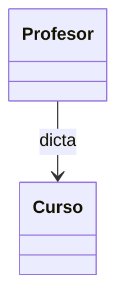

Es la relación más genérica: un objeto **conoce** a otro y colabora con él, pero cada uno tiene vida propia.

> Herencia y realización son casos especiales. Cuando dudes, "asociación" es el default.

**🔍 Cómo la reconozco**
- Pregunta clave: *"¿X **usa / conoce a** Y de forma permanente?"*
- En el código, X guarda a Y como **atributo** (pero **no** lo "posee" como parte suya).
- Suele ser **bidireccional** o llevar **verbo** ("dicta", "atiende", "reserva") y **multiplicidad**.

**Más ejemplos**
- `Medico --> Paciente : atiende`
- `Cliente --> Pedido : realiza`
- `Alumno "*" --> "*" Materia : cursa`

**Agregación y composición son tipos *especiales* de asociación** (un "tiene un" más fuerte). Si la relación es un simple "conoce/usa" sin sensación de *todo–parte*, quedate con la asociación simple.

---

## Agregación vs. Composición

Ambas son **"tiene un"** (una clase tiene un atributo de otra clase). Se diferencian en la **fuerza de la dependencia**:

| | Agregación (débil) | Composición (fuerte) |
|---|---|---|
| Símbolo | rombo **vacío** `o--` | rombo **lleno** `*--` |
| ¿El todo puede existir sin la parte? | **Sí** | **No** |
| Ejemplo | Auto ◇— AireAcondicionado | Auto ◆— Motor |

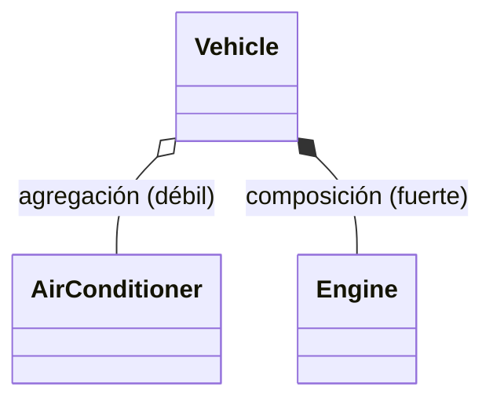

> El auto **funciona** sin aire (agregación), pero **no** sin motor (composición).

**🔍 Cómo las reconozco**
- Pregunta clave: *"Si destruyo el **todo**, ¿la **parte** sigue teniendo sentido / vida propia?"*
  - **Sí sobrevive** → **agregación** (rombo vacío). La parte se recibe *desde afuera* (por constructor/setter) y puede compartirse.
  - **No sobrevive** → **composición** (rombo lleno). El todo **crea y destruye** a la parte; nadie más la usa.
- El **rombo va siempre del lado del "todo"** (el contenedor).

**Ejemplos para fijar la diferencia**

| Todo — Parte | Tipo | Por qué |
|---|---|---|
| Equipo ◇— Jugador | Agregación | el jugador existe aunque se disuelva el equipo (juega en otro) |
| Playlist ◆— Cancion (en orden) | Composición | el orden/entrada de esa playlist muere con ella |
| Casa ◆— Habitacion | Composición | la habitación no existe sin la casa |
| Universidad ◇— Profesor | Agregación | el profesor sigue existiendo (y puede dar clase en otra) |

```typescript
// Composición: el todo CREA la parte adentro
class Casa {
  private habitaciones = [new Habitacion(), new Habitacion()]; // nacen y mueren con la Casa
}

// Agregación: el todo RECIBE la parte de afuera
class Equipo {
  constructor(private jugadores: Jugador[]) {} // vienen ya creados desde afuera
}
```

> 🧭 Truco visual: **rombo lleno = "vida y muerte juntas"**; **rombo vacío = "vidas independientes"**.

---

## Dependencia

**"depende de"** — la relación más **débil y temporal**. Una clase usa a otra solo de paso (p. ej. como parámetro de un método). Flecha **punteada**.

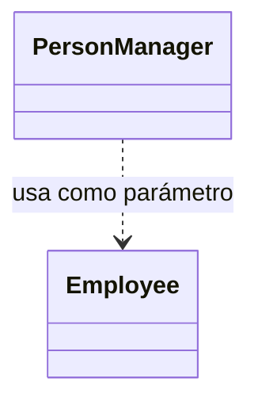

```typescript
class PersonManager {
  getName(employee: Employee): string { return employee.getName(); }
}
```

> Diferencia con asociación: en dependencia **no** guardo al otro como atributo, solo lo uso momentáneamente.

**🔍 Cómo la reconozco**
- Pregunta clave: *"¿X usa a Y **solo por un rato** y después se olvida de él?"*
- Y aparece como **parámetro de un método**, **variable local**, o **tipo de retorno** — nunca como atributo guardado.
- Si borro a Y, X **deja de compilar**, pero X no "tiene" un Y.

**Más ejemplos**
- `ReporteService ..> PDFExporter : exportar(pdf)` (lo usa dentro de un método y lo suelta)
- `Calculadora ..> Logger : log(resultado)`
- `main ..> Person : new Person()` (la instancia y la usa localmente)

> Escala de "cuánto se conocen" (de más débil a más fuerte):
> **Dependencia** (de paso) → **Asociación** (lo conoce) → **Agregación** (lo tiene, débil) → **Composición** (lo tiene, fuerte).

---

## Cómo leer las flechas (mini-cheat)

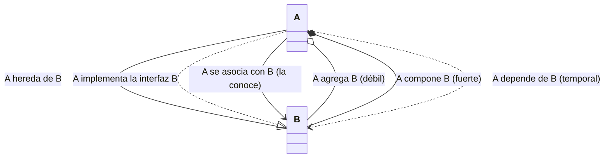

**Multiplicidad** (cuántos de cada lado): se anota en los extremos.
`1`, `0..1`, `*` (muchos), `1..*` (uno o más).

Ej: `Curso "1" --> "1..*" Alumno` → un curso tiene uno o más alumnos.

---

## Guía rápida: ¿qué relación es?

Frente a dos clases, hacéte estas preguntas **en orden**:

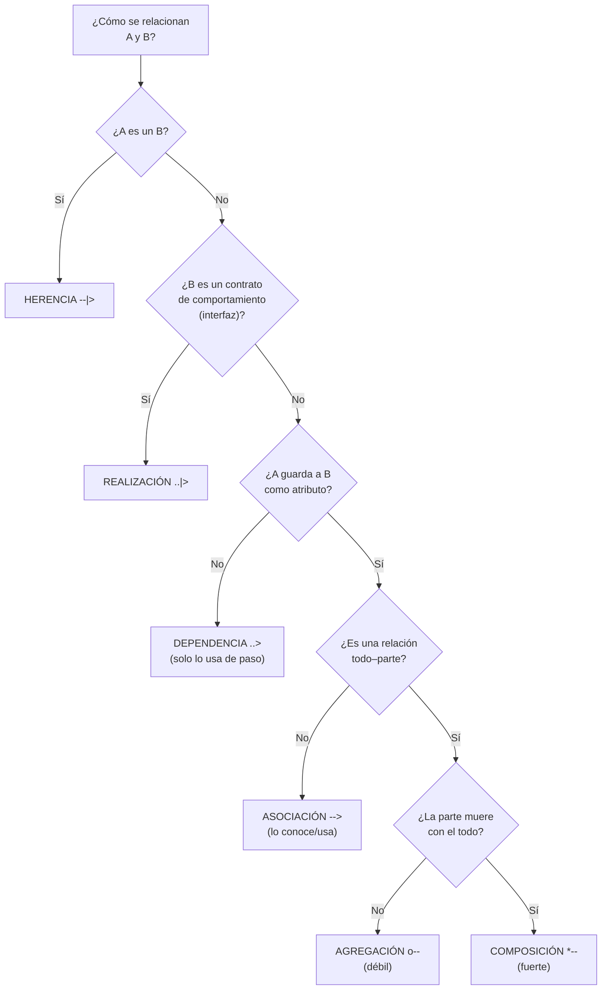

**En una frase, la pista lingüística de cada una:**
- "**es un**" → herencia · "**se comporta como**" → realización
- "**usa de paso**" → dependencia · "**conoce a**" → asociación
- "**tiene un** (separable)" → agregación · "**tiene un** (inseparable)" → composición

---

## De UML a TypeScript (mapeo)

| En el diagrama... | En TypeScript... |
|---|---|
| Caja de clase | `class Nombre { }` |
| `- atributo` | `private atributo` |
| `# atributo` | `protected atributo` |
| `+ metodo()` | `public metodo()` |
| Triángulo vacío (herencia) | `extends` |
| Triángulo punteado (realización) | `implements` |
| `<<interface>>` | `interface` |
| Rombo lleno (composición) | atributo de otra clase, creado adentro |
| Rombo vacío (agregación) | atributo de otra clase, recibido por constructor |

> Dibujar el UML **primero** y después traducir es una estrategia buenísima para no perderse.

---

## Clase abstracta vs. Interfaz (concepto)

Las dos sirven para **abstraer**, pero no son lo mismo:

| | Clase abstracta | Interfaz |
|---|---|---|
| ¿Se puede instanciar? | ❌ No | ❌ No |
| ¿Puede tener código (métodos con cuerpo)? | ✅ Sí (y también abstractos) | ❌ No, solo firmas |
| ¿Puede tener atributos con estado? | ✅ Sí | ⚠️ Solo la forma, sin valores |
| ¿Cuántas puede tener una clase? | **1** (`extends`) | **varias** (`implements A, B`) |
| Relación | "es un" | "se comporta como" |

> Una **clase abstracta** reúne características *comunes pero insuficientes* para tener identidad propia (ej: `Vehiculo`). Sus métodos abstractos **deben** implementarse en las subclases.

---

## Clase abstracta vs. Interfaz (código)

```typescript
// CLASE ABSTRACTA: comparte código + obliga a implementar lo abstracto
abstract class Vehicle {
  constructor(protected engine: Engine) {}

  honk(): void { console.log("¡Tu-tuuuu!"); }   // concreto (con cuerpo)

  abstract turnEngineOn(): boolean;              // abstracto (sin cuerpo)
}

class Car extends Vehicle {
  turnEngineOn(): boolean {                      // OBLIGATORIO implementarlo
    return this.engine.turnOn();
  }
}
```

```typescript
// INTERFAZ: solo el contrato, sin código
interface Turnable {
  turnOn(): boolean;
  turnOff(): boolean;
}

class Engine implements Turnable {
  turnOn(): boolean  { console.log("Encendiendo el motor"); return true; }
  turnOff(): boolean { console.log("Apagando el motor");    return true; }
}
```

---

## ¿Cuándo uso cada una?

**Usá clase abstracta cuando...**
- Hay una relación **"es un"** clara (jerarquía).
- Querés **compartir código** entre las subclases.
- Necesitás atributos con estado común.

**Usá interfaz cuando...**
- Querés definir un **contrato de comportamiento** ("se comporta como").
- Objetos de **naturaleza distinta** deben tratarse igual (`Engine` y `AirConditioner` son `Turnable`).
- Necesitás que una clase cumpla **varios** contratos.

> 💡 Buena práctica: **programar contra interfaces**, no contra implementaciones concretas → el código se vuelve intercambiable y fácil de mantener.

---

## 🛠️ Ejercicio guiado en vivo

**Enunciado:** modelemos un sistema simple de **biblioteca**.

> En una biblioteca hay **libros** y **revistas**; ambos son **material** que se puede **prestar** (tienen título y código, y se pueden marcar como prestado/devuelto).
> Un **socio** puede tener **prestados varios materiales** a la vez.
> Cada material tiene **un autor** (una persona).

**Consigna:** dibujar el **diagrama de clases** identificando:
1. ¿Qué conviene que sea **interfaz**, **clase abstracta** y **clase concreta**?
2. ¿Qué relaciones aparecen (herencia, realización, asociación, agregación/composición)?
3. Multiplicidades.

> Primero intentalo solo/a en papel o en Mermaid; después lo resolvemos juntos en la próxima slide.

---

## 🛠️ Ejercicio guiado — una solución posible

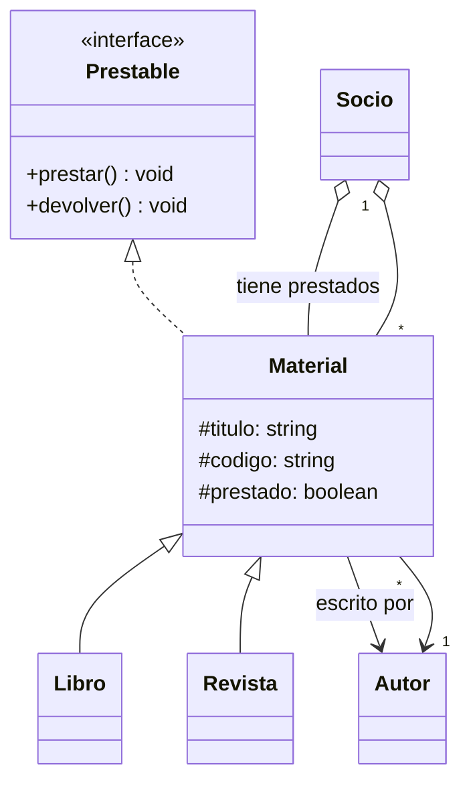

- `Prestable` → **interfaz** (contrato "se puede prestar").
- `Material` → **clase abstracta** (común a libro y revista, no se instancia sola).
- `Libro`, `Revista` → **clases concretas** (herencia).
- `Material → Autor` → **asociación** (multiplicidad `* -- 1`).
- `Socio ◇— Material` → **agregación** (el material existe aunque el socio no lo tenga).

> No hay una única respuesta correcta. Lo importante: `Material` es abstracta (no interfaz) porque tiene **estado y código común**.

---

## Cierre / Recap

Hoy vimos:

- **POO**: clase vs. objeto vs. instancia, y los **4 pilares** (encapsulamiento, abstracción, herencia, polimorfismo).
- **UML**: la caja de la clase, la **visibilidad** (`+ - # ~`) y las **5 relaciones**.
- **Herencia vs. realización vs. asociación vs. agregación vs. composición**.
- **Clase abstracta vs. interfaz** y cuándo usar cada una.

**Próxima clase:** Principios **S.O.L.I.D.** (Unidad 2) — cómo escribir POO *bien*.

---

## 📚 Después de clase — Cheat sheet UML

**Guardá esto a mano para el resto de la materia.**

**Visibilidad:** `+` público · `-` privado · `#` protegido · `~` paquete

**Relaciones:**

| Símbolo | Nombre | Significado | Código TS |
|:---:|---|---|---|
| `──▷` (triángulo vacío) | Herencia | "es un" | `extends` |
| `┈┈▷` (triángulo punteado) | Realización | "se comporta como" | `implements` |
| `───▶` (flecha simple) | Asociación | "usa / conoce" | atributo |
| `◇───` (rombo vacío) | Agregación | "tiene" (débil) | atributo por constructor |
| `◆───` (rombo lleno) | Composición | "tiene" (fuerte) | atributo creado adentro |
| `┈┈▶` (flecha punteada) | Dependencia | "usa de paso" | parámetro |

**Multiplicidad:** `1` · `0..1` · `*` (muchos) · `1..*` (uno o más)

---

## 📝 Después de clase — Ejercicios

Para cada enunciado, **dibujá el diagrama de clases** (en papel o Mermaid) con clases, visibilidad, relaciones y multiplicidades.

1. **Reproductor de música:** una `Playlist` contiene muchas `Canciones`. Una canción tiene un `Artista`. La playlist no tiene sentido sin sus canciones. *(Pista: ¿composición o agregación?)*

2. **Formas geométricas:** `Circulo`, `Rectangulo` y `Triangulo` son `Figuras`. Toda figura puede calcular su `area()`, pero cada una lo hace distinto. *(Pista: ¿abstracta o interfaz? ¿dónde va el método abstracto?)*

3. **Medios de pago:** una `Tienda` procesa pagos con `TarjetaCredito`, `Efectivo` o `Transferencia`. Todos "se comportan como" algo que se puede `pagar()`. *(Pista: pensá en programar contra interfaces.)*

4. **Equipo de fútbol:** un `Equipo` tiene un `DT` (una persona) y entre 11 y 25 `Jugadores` (también personas). *(Pista: multiplicidades y herencia desde `Persona`.)*

> Traé los 4 diagramas para revisarlos al inicio de la próxima clase.

---

## 📖 Después de clase — Lectura corta: abstracta vs. interfaz en TS

Leé y respondé en 3-4 líneas cada una:

1. Escribí una **interfaz** `Comparable` con un método `compareTo(other): number` y hacé que una clase `Producto` la implemente comparando por precio.
2. Escribí una **clase abstracta** `Animal` con un método concreto `dormir()` y uno abstracto `hacerSonido()`. Creá `Perro` y `Gato` que la extiendan.
3. Respondé: *¿por qué no puedo hacer `new Animal()` ni `new Comparable()`?*
4. Respondé: *si mañana necesito que `Producto` sea además "serializable a JSON", ¿me conviene otra interfaz u otra clase abstracta? ¿por qué?*

**Recursos para ampliar** (opcional):
- TypeScript Handbook — *Classes* y *Interfaces* (documentación oficial).
- Buscar: "UML class diagram cheat sheet" para ver más ejemplos de notación.
- Herramienta para practicar diagramas: Mermaid Live Editor.

> Estos ejercicios preparan el terreno para **SOLID** (próxima clase), que se apoya fuerte en interfaces y abstracción.
